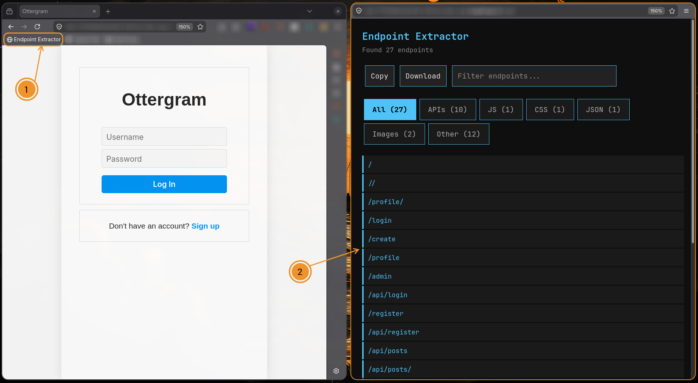

A bookmarklet for extracting API endpoints (not just apis) from JavaScript files loaded in the browser. Designed for security researchers, penetration testers, and developers who need quick visibility into client-side endpoints.

Endpoint Extractor scans JavaScript resources in the current page and identifies potential API endpoints. It operates entirely within the browser and requires no installation or external dependencies.

# Installation
1. Open the raw script: https://raw.githubusercontent.com/Rezy-Dev/Endpoint-Extractor/refs/heads/main/extract.js
2. Copy the entire contents of the file.
3. Create a new bookmark in your browser with the following:
- Name: Endpoint Extractor
- URL: `javascript:...snip...`
4. Save the bookmark.

---

# Usage
1. Navigate to the target web application.
2. Click the "Endpoint Extractor" bookmark.
3. A new window will open displaying the extracted endpoints.

# Example

